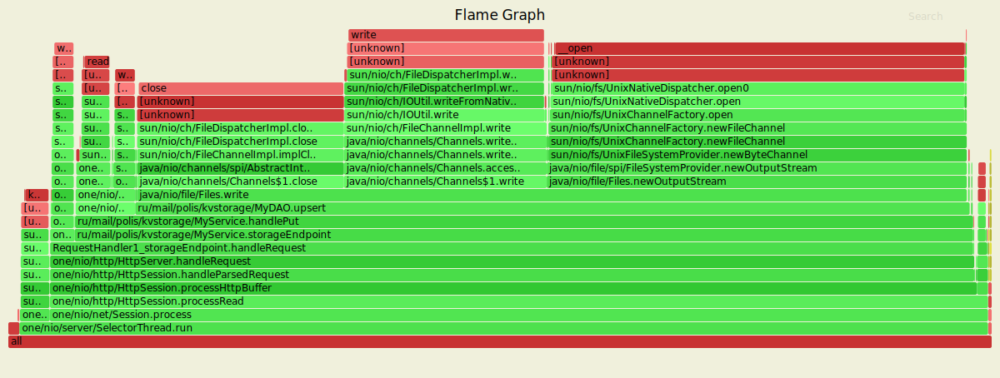

# Профилирование
## Метод PUT
### Результаты async-profiler

### Утилита wrk
```
wrk --latency -c2 -t2 -d2m -s put.lua http://localhost:8080
Running 2m test @ http://localhost:8080
  2 threads and 2 connections
  Thread Stats   Avg      Stdev     Max   +/- Stdev
    Latency   119.07ms  321.54ms   1.96s    89.28%
    Req/Sec     1.13k   312.88     1.44k    87.72%
  Latency Distribution
     50%  802.00us
     75%    1.07ms
     90%  501.42ms
     99%    1.50s
  214678 requests in 2.00m, 13.72MB read
  Socket errors: connect 0, read 0, write 0, timeout 2
Requests/sec:   1788.27
Transfer/sec:    117.01KB
```
## Метод GET
### Результаты async-profiler

### Утилита wrk
```wrk --latency -c2 -t2 -d2m -s get.lua http://localhost:8080
Running 2m test @ http://localhost:8080
  2 threads and 2 connections
  Thread Stats   Avg      Stdev     Max   +/- Stdev
    Latency     6.11ms   50.65ms 771.35ms   98.37%
    Req/Sec     3.05k     1.34k    4.61k    42.17%
  Latency Distribution
     50%  213.00us
     75%  441.00us
     90%  624.00us
     99%  259.27ms
  717995 requests in 2.00m, 47.04MB read
  Non-2xx or 3xx responses: 498372
Requests/sec:   5981.27
Transfer/sec:    401.25KB
```
## Метод DELETE
### Результаты async-profiler

### Утилита wrk
```
wrk --latency -c2 -t2 -d2m -s delete.lua http://localhost:8080
Running 2m test @ http://localhost:8080
  2 threads and 2 connections
  Thread Stats   Avg      Stdev     Max   +/- Stdev
    Latency    35.99ms  123.30ms   1.38s    92.77%
    Req/Sec   776.58    291.28     1.21k    71.05%
  Latency Distribution
     50%    0.96ms
     75%    2.11ms
     90%   96.10ms
     99%  667.56ms
  167160 requests in 2.00m, 10.84MB read
Requests/sec:   1392.19
Transfer/sec:     92.45KB
```
